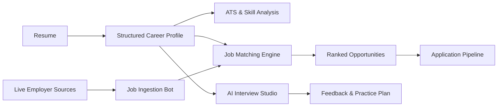

# CarrerFit.com

> **AI-powered career intelligence for job discovery, resume analysis, and interview preparation.**

[](https://carrerfit.com)


**CarrerFit** is a full-stack career platform that connects the entire job-search workflow: discover live roles, understand your fit, improve your resume, practice interviews, and track applications — from one private career workspace.

## ✨ What it does

- **Live job discovery** — searchable roles imported from public employer career systems.
- **AI resume intelligence** — PDF/DOCX parsing, ATS analysis, structured profile extraction, and evidence-based recommendations.
- **Job matching** — ranks opportunities using skills, experience, seniority, work mode, and resume evidence.
- **AI mock interviews** — resume-aware questions, adaptive follow-ups, speech input, and per-answer coaching.
- **Application tracking** — manage Saved → Applied → Interview → Offer from a personal dashboard.
- **Career assessment** — maps interests, strengths, experience, and working style to potential career paths.
- **Career content** — database-backed guides, RSS, sitemap, structured metadata, and publishing tools.

## 🧠 Career intelligence flow



## 🚀 Job ingestion engine

CarrerFit includes its own ingestion pipeline for public employer-hosted job data.

**Supported sources**
- Greenhouse
- Lever
- Ashby
- Structured `JobPosting` career pages

The bot normalizes jobs into a common schema, filters stale listings, deduplicates records, respects `robots.txt` for generic sources, blocks private-network targets, and keeps applications linked to the original employer page.

Scheduled ingestion runs through **GitHub Actions** and persists source health, active jobs, failures, and run history.

## 🛠 Tech stack

| Layer | Technology |
| --- | --- |
| Frontend | Next.js 15, React 19, TypeScript |
| API | Express 5, Node.js |
| AI | OpenAI + Groq fallback |
| Database | MySQL / MariaDB, SQLite fallback |
| Resume parsing | PDF.js, Mammoth |
| Validation | Zod |
| Security | Helmet, rate limiting, signed sessions, encrypted resume storage |
| Automation | GitHub Actions |
| Scraping / parsing | Cheerio + ATS-specific adapters |

## 🔐 Security-first architecture

CarrerFit handles career and resume data as private user information.

- Verified-email accounts and server-side sessions
- Password hashing and one-time recovery flows
- AES-256-GCM encrypted resume storage
- Same-origin protections for mutating requests
- SSRF protection for job-source ingestion
- HTTPS-only source validation
- Rate-limited resume, interview, authentication, and scraper APIs
- Camera frames remain in the browser during interview coaching

## ⚡ Run locally

Requires **Node.js 20–22**.

```bash
git clone https://github.com/fcopensource/carrerfitnew.git
cd carrerfitnew
npm install
cp .env.example .env
npm run dev
```

Web app: `http://localhost:3000`  
API: `http://localhost:4000`

### Production

```bash
npm run build
npm start
```

Core environment groups:

```text
OPENAI_* / GROQ_*       AI providers
DB_*                    MySQL / MariaDB
SMTP_*                  Email verification & recovery
AUTH_SECRET             Session security
SCRAPER_ADMIN_TOKEN     Job-source administration
CRON_SECRET             Scheduled ingestion
BLOG_ADMIN_TOKEN        Publishing administration
```

See `.env.example` for the complete configuration.

## 🧪 Quality checks

```bash
npm run typecheck
npm test
```

The test suite covers authentication, blog storage, matching, ATS analysis, interviews, and job ingestion.

## 📁 Project structure

```text
app/              Next.js application and routes
components/       Shared React components
server/           API, AI, auth, jobs, ingestion, persistence
scripts/          Tests and migration utilities
lib/              Shared types and utilities
.github/workflows Job-ingestion automation
```

## 🌱 Product direction

CarrerFit is evolving from a job portal into a **career operating system** — one profile that continuously connects job-market data, resume evidence, skill gaps, interview preparation, and application progress.

---

**Live:** [carrerfit.com](https://carrerfit.com)  
Built as an end-to-end career intelligence platform with TypeScript.

## 📄 License

This project is licensed under the **MIT License**. See [LICENSE](./LICENSE) for details.
