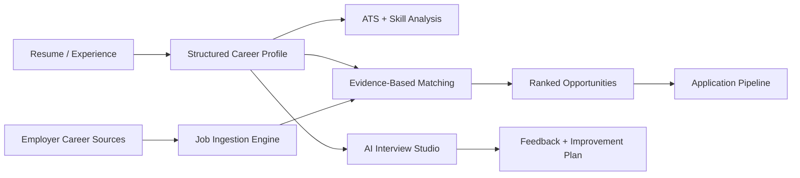

# CarrerFit.com

> **AI-powered career intelligence for jobs, resumes, skills, interviews, and applications.**

[](https://carrerfit.com)
[](./LICENSE)


**CarrerFit** connects the full career workflow in one place: discover live jobs, understand your resume evidence, identify skill gaps, practice interviews, and track applications.

The product is built around an **evidence-first** idea: match people to opportunities using what they can actually prove, not only keywords.

**Live:** https://carrerfit.com

---

## ✨ What CarrerFit does

| Area | Capability |
| --- | --- |
| 🔎 **Live Jobs** | Imports roles from public employer career systems |
| 📄 **Resume Intelligence** | PDF/DOCX parsing, ATS analysis, structured profile extraction |
| 🎯 **Job Matching** | Compares skills, experience, seniority, work mode, and resume evidence |
| 🎤 **AI Interviews** | Resume-aware questions, adaptive follow-ups, speech input, coaching reports |
| 📌 **Application Tracking** | Saved → Applied → Interview → Offer workflow |
| 🧭 **Career Assessment** | Maps strengths, interests, experience, and work preferences to career paths |
| 🧪 **Practice Lab** | Coding and aptitude practice |
| 📰 **Career Guides** | SEO-ready career content, RSS, sitemap, and publishing tools |

---

## 🧠 Career intelligence flow


```mermaid
flowchart LR
    A[Resume / Experience] --> B[Structured Career Profile]
    B --> C[ATS + Skill Analysis]
    B --> D[Evidence-Based Matching]
    E[Employer Career Sources] --> F[Job Ingestion Engine]
    F --> D
    D --> G[Ranked Opportunities]
    G --> H[Application Pipeline]
    B --> I[AI Interview Studio]
    I --> J[Feedback + Improvement Plan]
```

CarrerFit aims to answer:

> **What can this person prove, which opportunities fit that evidence, what is missing, and what should they do next?**

---

## 🚀 Job ingestion engine

CarrerFit includes its own public-job ingestion pipeline with support for:

- **Greenhouse**
- **Lever**
- **Ashby**
- Structured **JobPosting** employer pages

The pipeline normalizes different job formats, deduplicates listings, tracks source health, filters stale records, preserves employer-hosted application URLs, validates HTTPS sources, includes SSRF protections, and respects `robots.txt` for generic career-page crawling.

Scheduled refreshes run through **GitHub Actions**.

---

## 📄 Resume + interview intelligence

### Resume pipeline

```text
PDF / DOCX
   ↓
Text extraction
   ↓
Structured career profile
   ↓
ATS analysis
   ↓
Skill + experience evidence
   ↓
Live job comparison
   ↓
Ranked opportunities + gaps
```

Resume analysis uses **PDF.js**, **Mammoth**, structured AI extraction, **Zod** validation, deterministic ATS scoring, fallback matching, and encrypted storage for signed-in users.

### AI interview studio

The interview workflow supports:

- Resume-aware questions
- Adaptive follow-ups
- Technical and behavioral practice
- Speech input and browser text-to-speech
- Per-answer coaching
- Final performance reports
- Optional on-device camera coaching signals

Camera frames remain in the browser.

---

## 🛠 Tech stack

| Layer | Technology |
| --- | --- |
| Frontend | Next.js 15, React 19, TypeScript |
| Backend | Node.js, Express 5, Next.js route handlers |
| AI | OpenAI + Groq fallback |
| Database | MySQL / MariaDB, SQLite fallback |
| Resume parsing | PDF.js, Mammoth |
| Validation | Zod |
| Authentication | Argon2, server-side sessions |
| Security | AES-256-GCM, Helmet, rate limiting, origin validation |
| Scraping | Cheerio + ATS-specific adapters |
| Automation | GitHub Actions |
| Email | Nodemailer / SMTP |

---

## 🔐 Security

CarrerFit treats resume and career data as private user information.

- Argon2 password hashing
- Server-side sessions with hashed tokens
- AES-256-GCM encrypted resume storage
- Email verification and one-time recovery flows
- Same-origin validation for mutating requests
- HTTPS-only job-source validation
- Private-network / SSRF protections
- Rate-limited authentication, resume, interview, scraper, and admin workflows

---

## ⚡ Run locally

Requires **Node.js 20–22**.

```bash
git clone https://github.com/fcopensource/carrerfitnew.git
cd carrerfitnew

npm install
cp .env.example .env
npm run dev
```

```text
Web   http://localhost:3000
API   http://localhost:4000
```

Production:

```bash
npm run build
npm start
```

Main environment groups:

```text
OPENAI_* / GROQ_*       AI providers
DB_* / DATABASE_URL     MySQL / MariaDB
SMTP_*                  Verification and recovery
AUTH_SECRET             Sessions and encrypted private data
SCRAPER_ADMIN_TOKEN     Job-source administration
CRON_SECRET             Scheduled ingestion
BLOG_ADMIN_TOKEN        Career-guide publishing
APP_URL / WEB_URL       Public deployment URL
```

See `.env.example` for the full configuration.

---

## 🧪 Quality checks

```bash
npm run typecheck
npm test
```

The repository includes focused tests for authentication, blog storage, matching, ATS analysis, interviews, and job ingestion.

---

## 📁 Project structure

```text
app/                  Next.js pages, layouts and API routes
components/           Shared UI components
server/               AI, auth, resume, jobs, ingestion, persistence
lib/                  Shared types and utilities
scripts/              Tests and migration utilities
.github/workflows/    Scheduled automation
```

Key backend modules:

```text
server/ai-provider.ts     AI provider abstraction + fallback
server/ats.ts             ATS scoring
server/interview.ts       Adaptive interview logic
server/job-bot.ts         Job ingestion orchestration
server/job-scraper.ts     Employer job adapters and parsing
server/matcher.ts         Career and job matching
server/resume.ts          Resume extraction
server/resume-vault.ts    Encrypted resume storage
```

---

## 🌱 Product direction

CarrerFit is evolving from a job portal into a **career operating system**:

```text
Career Profile
    ↓
Live Job Market
    ↓
Explainable Matching
    ↓
Skill Gaps
    ↓
Application Action
    ↓
Interview Practice
    ↓
Outcome Feedback
```

The long-term direction includes deeper career graphs, personalized ranking, company and salary intelligence, skill-gap planning, interview progress analytics, and smarter application workflows.

---

## 📄 License

Licensed under the **MIT License**. See [LICENSE](./LICENSE).

---

<p align="center">
  <strong>CarrerFit.com</strong><br/>
  Build evidence. Find better-fit opportunities. Prepare with purpose.
</p>
