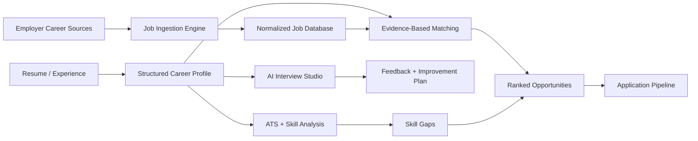

# CarrerFit.com

> **AI-powered career intelligence for jobs, resumes, skills, interviews, and applications.**

[](https://carrerfit.com)
[](./LICENSE)


**CarrerFit** is a full-stack career platform built around one idea: career decisions are better when they are connected to **real evidence**.

Instead of treating job search, resume improvement, interview practice, and application tracking as separate tools, CarrerFit connects them into one workflow — from **resume evidence → job matching → preparation → application progress**.

**Live product:** https://carrerfit.com

---

## ✨ Core experience

| Area | What CarrerFit does |
| --- | --- |
| 🔎 **Live Jobs** | Imports and normalizes roles from public employer career systems |
| 📄 **Resume Intelligence** | Parses PDF/DOCX resumes, extracts structured career evidence, and runs ATS analysis |
| 🎯 **Job Matching** | Compares skills, experience, seniority, work mode, and resume evidence against opportunities |
| 🎤 **AI Interviews** | Generates resume-aware questions, adaptive follow-ups, answer feedback, and final coaching reports |
| 📌 **Application Tracking** | Tracks opportunities through Saved → Applied → Interview → Offer |
| 🧭 **Career Assessment** | Maps strengths, interests, work preferences, and experience to realistic career directions |
| 🧪 **Practice Lab** | Includes coding and aptitude practice workflows |
| 📰 **Career Guides** | Database-backed editorial content with sitemap, RSS, metadata, and publishing tools |

---

## 🧠 How CarrerFit thinks

CarrerFit is designed around an **evidence-first career graph**.


```mermaid
flowchart LR
    A[Resume / Experience] --> B[Structured Career Profile]
    B --> C[ATS + Skill Analysis]
    B --> D[Evidence-Based Matching]

    E[Employer Career Sources] --> F[Job Ingestion Engine]
    F --> G[Normalized Job Database]
    G --> D

    D --> H[Ranked Opportunities]
    H --> I[Application Pipeline]

    B --> J[AI Interview Studio]
    J --> K[Feedback + Improvement Plan]

    C --> L[Skill Gaps]
    L --> H
```

The product goal is not simply to answer **“Is this a good resume?”** or **“What jobs are available?”**

It aims to answer:

> **What can this person genuinely prove, which opportunities fit that evidence, what is missing, and what should they do next?**

---

## 🚀 Job ingestion engine

CarrerFit includes its own public-job ingestion pipeline.

### Supported source types

- **Greenhouse**
- **Lever**
- **Ashby**
- Generic employer pages exposing structured **JobPosting** data

### Ingestion capabilities

- Normalizes different employer formats into one job schema
- Deduplicates imported roles
- Tracks source health and ingestion history
- Filters stale / low-quality records
- Preserves employer-hosted application URLs
- Uses HTTPS-only source validation
- Includes private-network / SSRF protections
- Respects `robots.txt` for generic career-page crawling
- Runs scheduled refreshes through **GitHub Actions**

The crawler is designed for official employer-hosted opportunities rather than republishing arbitrary third-party job-board content.

---

## 📄 Resume intelligence pipeline

```text
PDF / DOCX
   ↓
Text extraction
   ↓
Structured career profile
   ↓
ATS analysis
   ↓
Skill + experience evidence
   ↓
Live job comparison
   ↓
Ranked opportunities + gaps
```

Resume processing currently includes:

- PDF parsing with **PDF.js**
- DOCX parsing with **Mammoth**
- Structured AI extraction
- Schema validation with **Zod**
- Deterministic ATS scoring
- AI-assisted job-fit explanations
- Local fallback matching when an AI provider is unavailable
- AES-256-GCM encrypted resume storage for signed-in users

---

## 🎤 AI interview studio

The interview workflow uses the candidate's actual profile and target role to create a more realistic practice session.

It supports:

- Resume-aware interview setup
- Adaptive follow-up questions
- Role-specific technical / behavioral questioning
- Speech input
- Browser text-to-speech
- Per-answer coaching
- Final multi-dimension report
- Optional on-device camera coaching signals

Camera frames stay in the browser; only local numeric practice signals are used by the interview flow.

---

## 🏗️ Architecture

```text
                         ┌─────────────────────────┐
                         │      Next.js 15 UI      │
                         │ React 19 + TypeScript   │
                         └────────────┬────────────┘
                                      │
                    ┌─────────────────┴─────────────────┐
                    │                                   │
          ┌─────────▼─────────┐               ┌─────────▼─────────┐
          │   API / Services   │               │ Career Content /  │
          │ Auth, Resume, AI,  │               │ SEO / Blog / RSS  │
          │ Jobs, Interviews   │               └───────────────────┘
          └─────────┬─────────┘
                    │
        ┌───────────┼──────────────┬──────────────────┐
        │           │              │                  │
┌───────▼──────┐ ┌──▼──────────┐ ┌─▼─────────────┐ ┌─▼────────────────┐
│ MySQL /      │ │ OpenAI /    │ │ Job Ingestion │ │ SMTP / Account   │
│ MariaDB      │ │ Groq        │ │ Greenhouse    │ │ Verification     │
│ SQLite dev   │ │ fallback    │ │ Lever / Ashby │ │ + Recovery       │
└──────────────┘ └─────────────┘ └───────────────┘ └──────────────────┘
```

---

## 🛠 Tech stack

| Layer | Technology |
| --- | --- |
| Frontend | Next.js 15, React 19, TypeScript |
| Backend | Node.js, Express 5, Next.js route handlers |
| AI | OpenAI with Groq fallback |
| Database | MySQL / MariaDB, SQLite fallback |
| Validation | Zod |
| Resume parsing | PDF.js, Mammoth |
| Authentication | Argon2, server-side sessions, email verification |
| Security | AES-256-GCM, Helmet, rate limiting, origin validation |
| Scraping | Cheerio + ATS-specific adapters |
| Automation | GitHub Actions |
| Email | Nodemailer / SMTP |

---

## 🔐 Security principles

Career and resume data are treated as private user information.

- Passwords are one-way hashed with **Argon2**
- Browser sessions use server-side session records
- Session tokens are stored as hashes
- Resume files and structured resume documents can be encrypted at rest
- Mutating requests use same-origin validation
- Job-source URLs are validated before crawling
- Private / restricted network destinations are blocked
- Resume, authentication, interview, scraper, and admin workflows are rate-limited
- Admin access is separated from standard user authentication

---

## ⚡ Local development

### Requirements

- **Node.js 20–22**
- npm
- Optional MySQL / MariaDB database
- AI provider credentials for full AI features

### Setup

```bash
git clone https://github.com/fcopensource/carrerfitnew.git
cd carrerfitnew

npm install
cp .env.example .env
npm run dev
```

Development services:

```text
Web      http://localhost:3000
API      http://localhost:4000
```

### Production

```bash
npm run build
npm start
```

---

## 🔧 Environment configuration

The main environment groups are:

```text
OPENAI_* / GROQ_*       AI providers
DB_* / DATABASE_URL     MySQL / MariaDB
SMTP_*                  Verification and password recovery
AUTH_SECRET             Sessions and encrypted private data
SCRAPER_ADMIN_TOKEN     Job-source administration
CRON_SECRET             Scheduled job ingestion
BLOG_ADMIN_TOKEN        Career-guide publishing
APP_URL / WEB_URL       Public deployment URL
```

See **`.env.example`** for the complete configuration.

---

## 🧪 Quality checks

```bash
npm run typecheck
npm test
```

Focused test commands are also available for:

- authentication
- blog storage
- job matching
- ATS analysis
- AI interviews
- job ingestion

---

## 📁 Repository structure

```text
app/                  Next.js pages, layouts and API routes
components/           Shared UI and product components
server/               Auth, AI, resume, jobs, ingestion and persistence
lib/                  Shared types and utilities
scripts/              Tests and migration utilities
public/               Static public assets
.github/workflows/    Scheduled automation
```

Important backend modules:

```text
server/ai-provider.ts     AI provider abstraction + fallback
server/ats.ts             ATS scoring
server/interview.ts       Adaptive interview logic
server/job-bot.ts         Job ingestion orchestration
server/job-database.ts    Job persistence and source state
server/job-scraper.ts     Greenhouse / Lever / Ashby / generic parsing
server/matcher.ts         Career and job matching
server/resume.ts          Resume extraction
server/resume-vault.ts    Encrypted resume storage
```

---

## 🌱 Product direction

CarrerFit is evolving from a job portal into a **career operating system**.

The long-term direction is to connect:

```text
Career Profile
    ↓
Live Job Market
    ↓
Explainable Matching
    ↓
Skill Gaps
    ↓
Application Action
    ↓
Interview Practice
    ↓
Outcome Feedback
    ↓
Updated Career Plan
```

Future product areas include deeper career graphs, stronger personalized ranking, company intelligence, salary intelligence, skill-gap planning, interview progress analytics, and smarter application workflows.

---

## 🤝 Contributing

Ideas, bug reports, and thoughtful improvements are welcome.

For substantial changes:

1. Create a focused branch
2. Keep changes scoped to one feature or fix
3. Run type checks and tests
4. Open a pull request with the reasoning behind the change

---

## 📄 License

CarrerFit is licensed under the **MIT License**.

See [LICENSE](./LICENSE) for details.

---

<p align="center">
  <strong>CarrerFit.com</strong><br/>
  Build evidence. Find better-fit opportunities. Prepare with purpose.
</p>
